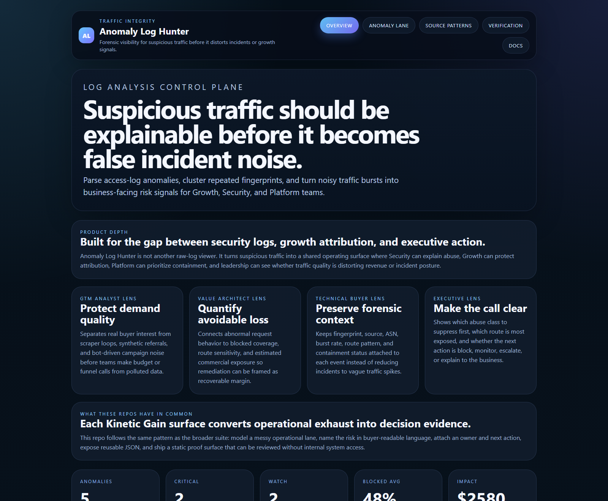
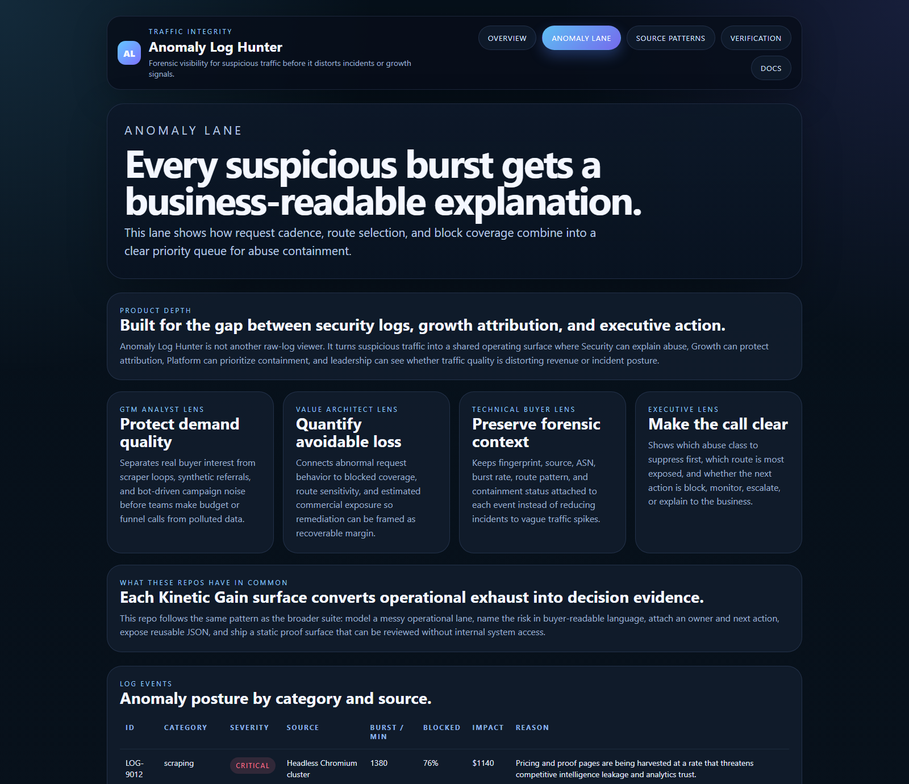
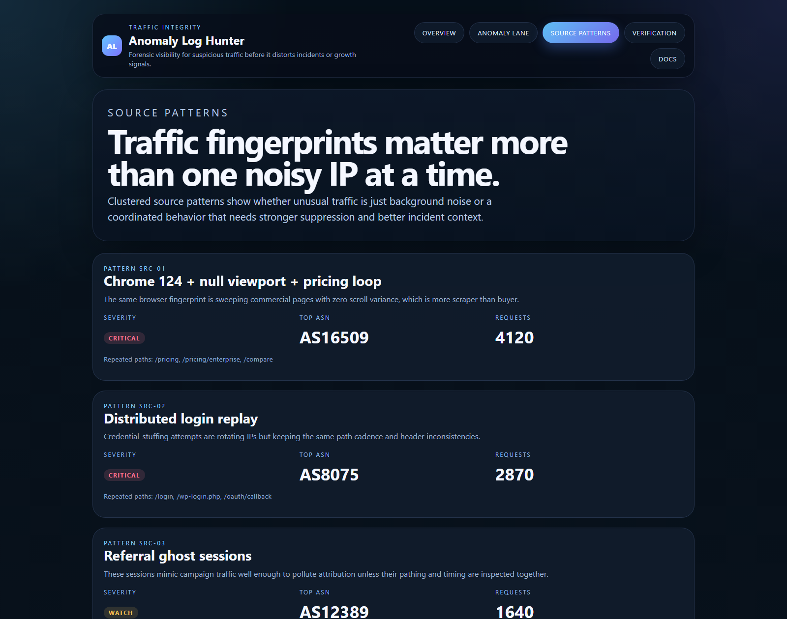
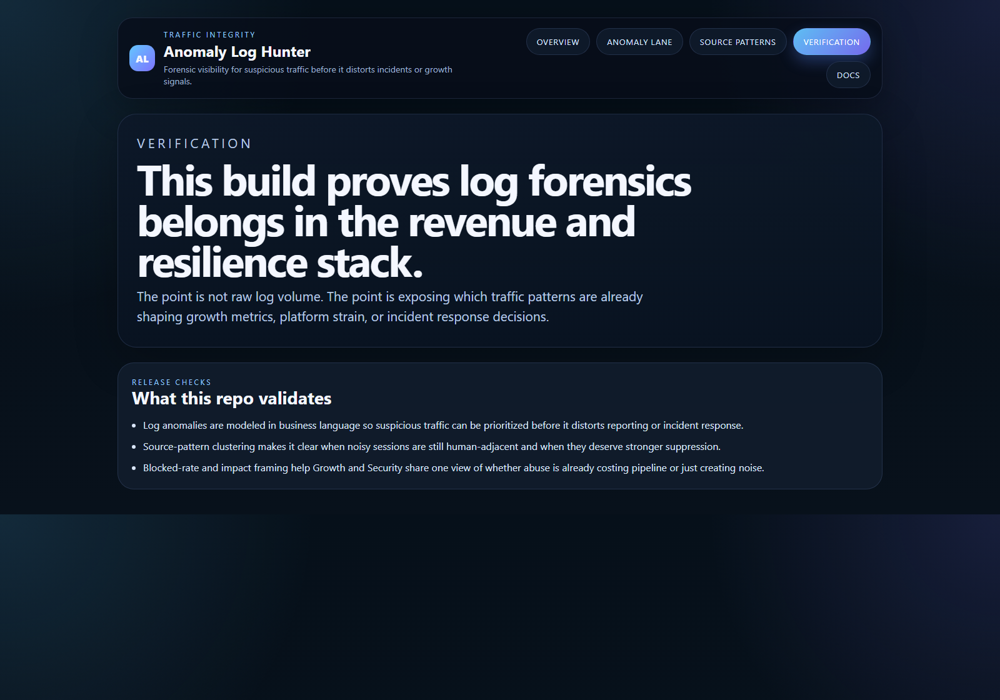

# Anomaly Log Hunter

Board-ready Kinetic Gain surface for parsing access-log anomalies, burst abuse, and suspicious source patterns before they distort traffic and incident signals.

- Live: [http://anomaly.kineticgain.com/](http://anomaly.kineticgain.com/)
- Repo: [https://github.com/mizcausevic-dev/anomaly-log-hunter](https://github.com/mizcausevic-dev/anomaly-log-hunter)

## Why this exists

Raw logs are usually where suspicious traffic goes to disappear. By then:
- scrapers have already harvested commercial pages
- credential stuffing looks like ordinary auth noise
- synthetic referrals seed attribution with fake demand
- incident response gets stuck arguing about whether a spike was real, malicious, or just marketing

`anomaly-log-hunter` turns abnormal traffic patterns into a business-readable queue before they distort resilience and growth decisions.

## What it includes

- TypeScript control plane for suspicious traffic, burst abuse, and source-pattern drift
- synthetic anomaly lane covering scraper bursts, auth noise, and attribution-shaped traffic
- reusable outputs for impact, block coverage, source clustering, and investigation posture
- prerendered static site, JSON payloads, screenshots, and docs

## What this product does

Anomaly Log Hunter is a traffic-integrity proof surface for the moment where Security, Growth, and Platform teams need the same answer: is this traffic real, risky, expensive, or misleading?

- **SaaS GTM analyst view:** protects campaign and funnel reporting from scraper loops, synthetic referrals, and bot-shaped demand before budget decisions are made from polluted signals.
- **SaaS value architect view:** translates abnormal request behavior into estimated commercial exposure, blocked coverage, and route-level priority so containment reads as recoverable margin.
- **Technical buyer view:** keeps fingerprint, source, ASN, burst rate, route pattern, severity, and next action attached to each anomaly instead of leaving raw logs as isolated ops evidence.
- **Executive narrative:** shows whether leadership should block, monitor, escalate, or explain the abnormal traffic before it becomes false incident noise or bad growth data.

## What these repos have in common

This repo follows the broader Kinetic Gain pattern: turn operational exhaust into decision evidence. Each surface models a messy control lane, names the risk in buyer-readable language, attaches an owner or next action, exposes reusable JSON, and ships a static proof page that can be reviewed without internal system access.

## Routes

- `/`
- `/anomaly-lane`
- `/source-patterns`
- `/verification`
- `/docs`

## API

- `/api/dashboard/summary`
- `/api/anomaly-lane`
- `/api/source-patterns`
- `/api/verification`
- `/api/sample`

## Screenshots






## Local Development

```powershell
cd anomaly-log-hunter
npm install
npm run dev
```

Open:
- [http://127.0.0.1:5360/](http://127.0.0.1:5360/)
- [http://127.0.0.1:5360/anomaly-lane](http://127.0.0.1:5360/anomaly-lane)
- [http://127.0.0.1:5360/source-patterns](http://127.0.0.1:5360/source-patterns)
- [http://127.0.0.1:5360/verification](http://127.0.0.1:5360/verification)
- [http://127.0.0.1:5360/docs](http://127.0.0.1:5360/docs)

## Validation

- `npm run verify`
- `npm run prerender`
- `npm run render:assets`

## Docs

- [Architecture](./docs/architecture.md)
- [Origin](./docs/ORIGIN.md)
- [Changelog](./CHANGELOG.md)
